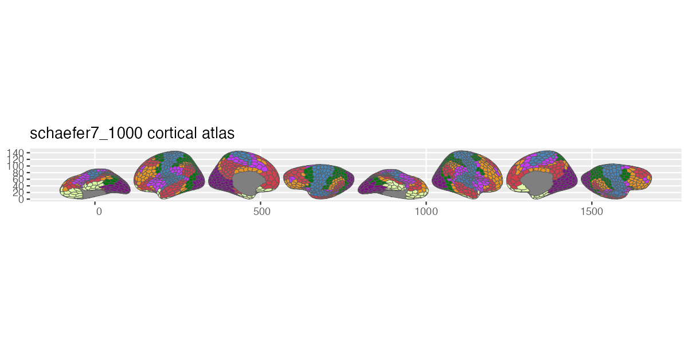
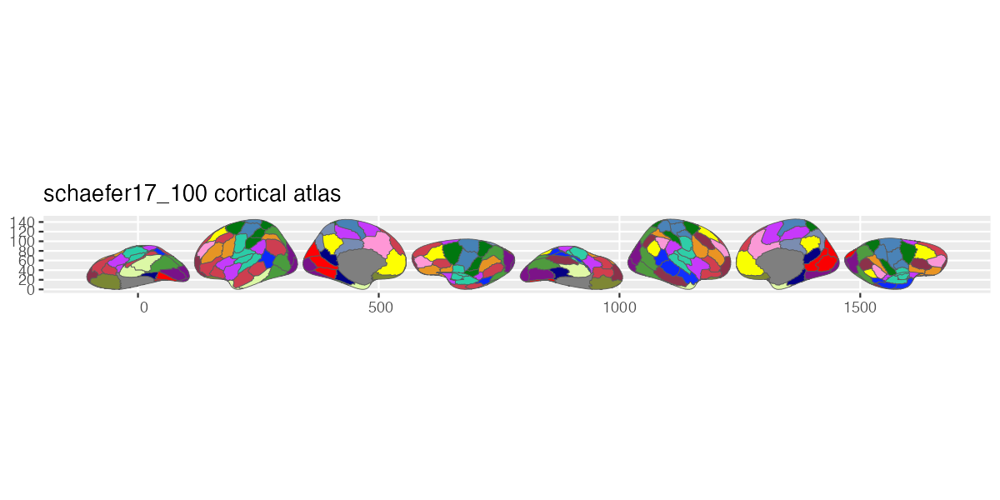

# ggsegSchaefer

Schaefer Atlas for the ggsegverse Ecosystem.

## Installation

``` r
# install.packages("remotes")
remotes::install_github("ggsegverse/ggsegSchaefer")
```

## Usage

``` r
library(ggsegSchaefer)
library(ggseg)

plot(schaefer7_400()) +
  theme_brain()
```

## Atlases

Local-global parcellation of the human cerebral cortex (Schaefer et al., 2018) in 7-network and 17-network variants at 10 resolutions (100--1000 parcels).

### Available variants

| Parcels | 7 Networks | 17 Networks |
|--------:|:-----------|:------------|
| 100 | `schaefer7_100()` | `schaefer17_100()` |
| 200 | `schaefer7_200()` | `schaefer17_200()` |
| 300 | `schaefer7_300()` | `schaefer17_300()` |
| 400 | `schaefer7_400()` | `schaefer17_400()` |
| 500 | `schaefer7_500()` | `schaefer17_500()` |
| 600 | `schaefer7_600()` | `schaefer17_600()` |
| 700 | `schaefer7_700()` | `schaefer17_700()` |
| 800 | `schaefer7_800()` | `schaefer17_800()` |
| 900 | `schaefer7_900()` | `schaefer17_900()` |
| 1000 | `schaefer7_1000()` | `schaefer17_1000()` |

### schaefer7\_100


### schaefer7\_1000



### schaefer17\_100



### schaefer17\_1000


