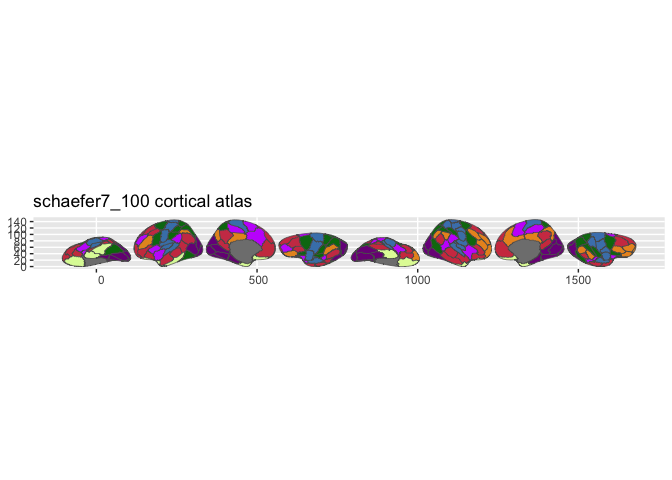
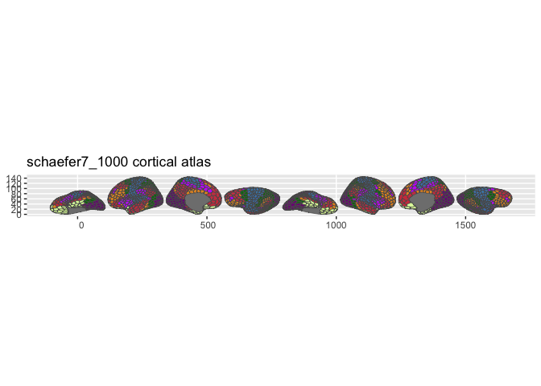
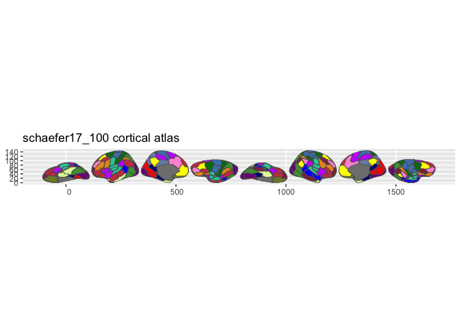
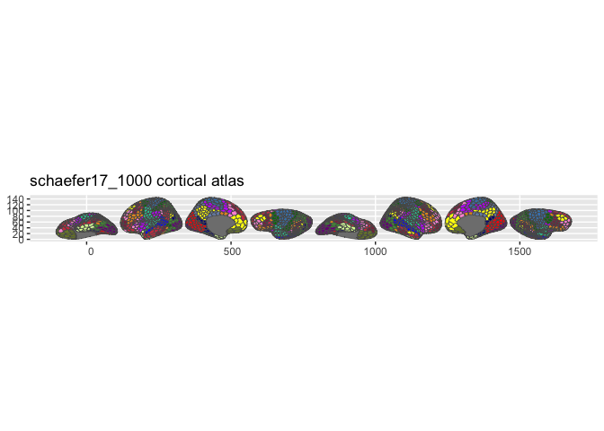

<!-- README.md is generated from README.Rmd. Please edit that file -->

# ggsegSchaefer

<!-- badges: start -->

[](https://github.com/ggsegverse/ggsegSchaefer/actions/workflows/R-CMD-check.yaml)
[](https://ggsegverse.r-universe.dev/ggsegSchaefer)
<!-- badges: end -->

Schaefer Atlas for the ggsegverse Ecosystem.

## Installation

``` r
# From r-universe
install.packages("ggsegSchaefer", repos = "https://ggsegverse.r-universe.dev")

# From GitHub
# install.packages("remotes")
remotes::install_github("ggsegverse/ggsegSchaefer")
```

## Atlases

Local-global parcellation of the human cerebral cortex (Schaefer et al.,
2018) in 7-network and 17-network variants at 10 resolutions.

### Available variants

| Parcels | 7 Networks         | 17 Networks         |
|--------:|:-------------------|:--------------------|
|     100 | `schaefer7_100()`  | `schaefer17_100()`  |
|     200 | `schaefer7_200()`  | `schaefer17_200()`  |
|     300 | `schaefer7_300()`  | `schaefer17_300()`  |
|     400 | `schaefer7_400()`  | `schaefer17_400()`  |
|     500 | `schaefer7_500()`  | `schaefer17_500()`  |
|     600 | `schaefer7_600()`  | `schaefer17_600()`  |
|     700 | `schaefer7_700()`  | `schaefer17_700()`  |
|     800 | `schaefer7_800()`  | `schaefer17_800()`  |
|     900 | `schaefer7_900()`  | `schaefer17_900()`  |
|    1000 | `schaefer7_1000()` | `schaefer17_1000()` |

### schaefer7_100

``` r
library(ggsegSchaefer)
plot(schaefer7_100())
```



### schaefer7_1000

``` r
plot(schaefer7_1000())
```



### schaefer17_100

``` r
plot(schaefer17_100())
```



### schaefer17_1000

``` r
plot(schaefer17_1000())
```


\## Data source

Annotation files from
[ThomasYeoLab/CBIG](https://github.com/ThomasYeoLab/CBIG) (fsaverage,
resampled to fsaverage5).

- **Reference**: Schaefer et al. (2018)
  [doi:10.1093/cercor/bhx179](https://doi.org/10.1093/cercor/bhx179)
- **Date obtained**: 2020-03-27
