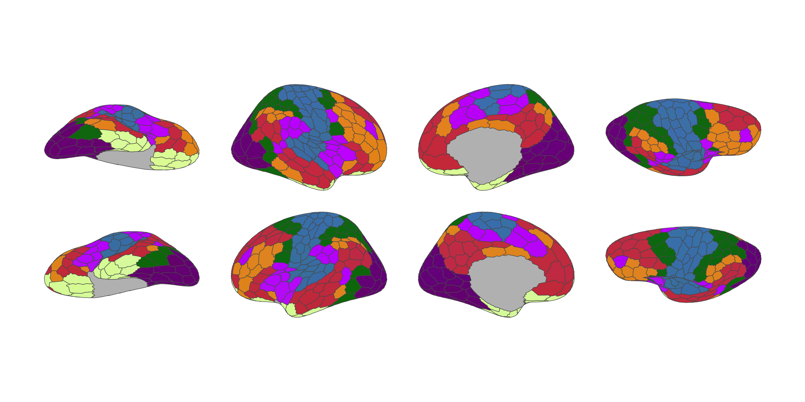
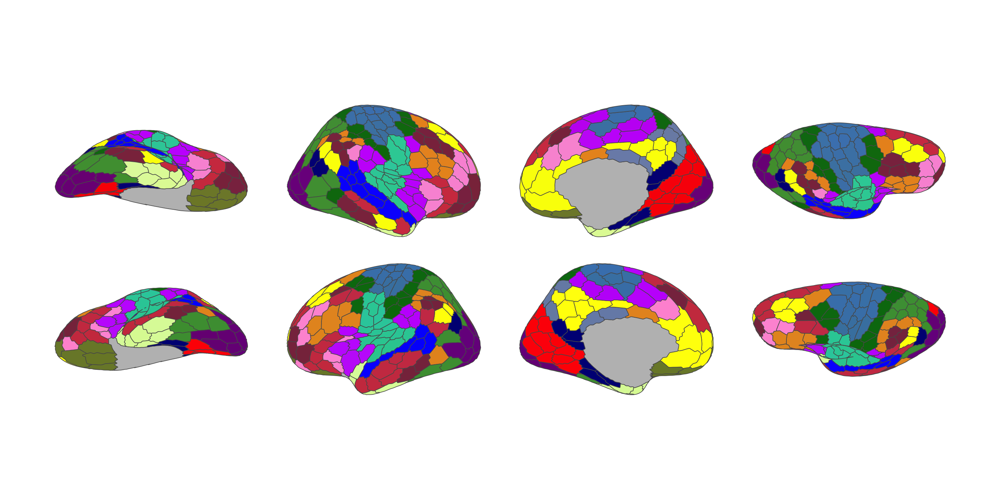

<!-- README.md is generated from README.qmd. Please edit that file -->

# ggsegSchaefer 

<!-- badges: start -->

[](https://github.com/ggsegverse/ggsegSchaefer/actions/workflows/R-CMD-check.yaml)
[](https://ggseg.r-universe.dev/ggsegSchaefer)
<!-- badges: end -->

This package contains the Schaefer cortical atlas for the ggseg
ecosystem. Includes both the 7-network and 17-network parcellations at
resolutions from 100 to 1000 parcels.

## Installation

We recommend installing the ggseg-atlases through the ggseg
[r-universe](https://ggseg.r-universe.dev/ui#builds):

``` r
options(repos = c(
  ggseg = "https://ggseg.r-universe.dev",
  CRAN = "https://cloud.r-project.org"
))

install.packages("ggsegSchaefer")
```

You can install this package from [GitHub](https://github.com/) with:

``` r
# install.packages("pak")
pak::pak("ggsegverse/ggsegSchaefer")
```

## Schaefer 7-network (400 parcels)

``` r
library(ggseg)
library(ggsegSchaefer)
library(ggplot2)

ggplot() +
  geom_brain(
    atlas = schaefer7_400(),
    mapping = aes(fill = label),
    position = position_brain(hemi ~ view),
    show.legend = FALSE
  ) +
  scale_fill_manual(values = schaefer7_400()$palette, na.value = "grey") +
  theme_void()
```



## Schaefer 17-network (400 parcels)

``` r
ggplot() +
  geom_brain(
    atlas = schaefer17_400(),
    mapping = aes(fill = label),
    position = position_brain(hemi ~ view),
    show.legend = FALSE
  ) +
  scale_fill_manual(values = schaefer17_400()$palette, na.value = "grey") +
  theme_void()
```



## Data source

Schaefer A, Kong R, Gordon EM, Laumann TO, Zuo XN, Holmes AJ, Eickhoff
SB, & Yeo BTT (2018). Local-global parcellation of the human cerebral
cortex from intrinsic functional connectivity MRI. *Cerebral Cortex*,
28(9), 3095-3114.
