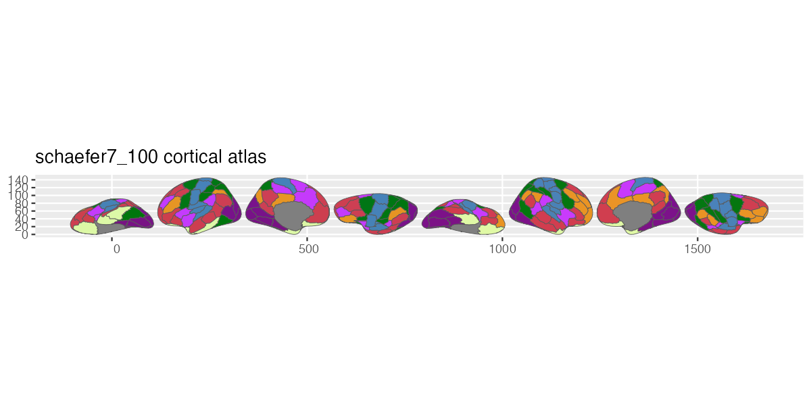
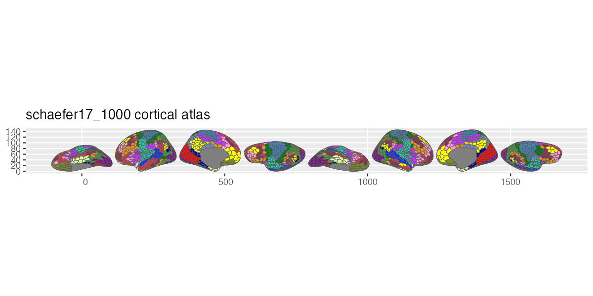

# ggsegSchaefer

Schaefer Atlas for the ggsegverse Ecosystem.

## Installation

``` r
# From r-universe
install.packages("ggsegSchaefer", repos = "https://ggsegverse.r-universe.dev")

# From GitHub
# install.packages("remotes")
remotes::install_github("ggsegverse/ggsegSchaefer")
```

## Usage

``` r
library(ggsegSchaefer)
library(ggseg)

plot(schaefer7_400()) +
  theme_brain()
```

## Atlases

Local-global parcellation of the human cerebral cortex (Schaefer et al.,
2018) in 7-network and 17-network variants at 10 resolutions (100–1000
parcels).

### Available variants

| Parcels | 7 Networks                                                                                   | 17 Networks                                                                                    |
|--------:|:---------------------------------------------------------------------------------------------|:-----------------------------------------------------------------------------------------------|
|     100 | [`schaefer7_100()`](https://ggsegverse.github.io/ggsegSchaefer/reference/schaefer7_100.md)   | [`schaefer17_100()`](https://ggsegverse.github.io/ggsegSchaefer/reference/schaefer17_100.md)   |
|     200 | [`schaefer7_200()`](https://ggsegverse.github.io/ggsegSchaefer/reference/schaefer7_200.md)   | [`schaefer17_200()`](https://ggsegverse.github.io/ggsegSchaefer/reference/schaefer17_200.md)   |
|     300 | [`schaefer7_300()`](https://ggsegverse.github.io/ggsegSchaefer/reference/schaefer7_300.md)   | [`schaefer17_300()`](https://ggsegverse.github.io/ggsegSchaefer/reference/schaefer17_300.md)   |
|     400 | [`schaefer7_400()`](https://ggsegverse.github.io/ggsegSchaefer/reference/schaefer7_400.md)   | [`schaefer17_400()`](https://ggsegverse.github.io/ggsegSchaefer/reference/schaefer17_400.md)   |
|     500 | [`schaefer7_500()`](https://ggsegverse.github.io/ggsegSchaefer/reference/schaefer7_500.md)   | [`schaefer17_500()`](https://ggsegverse.github.io/ggsegSchaefer/reference/schaefer17_500.md)   |
|     600 | [`schaefer7_600()`](https://ggsegverse.github.io/ggsegSchaefer/reference/schaefer7_600.md)   | [`schaefer17_600()`](https://ggsegverse.github.io/ggsegSchaefer/reference/schaefer17_600.md)   |
|     700 | [`schaefer7_700()`](https://ggsegverse.github.io/ggsegSchaefer/reference/schaefer7_700.md)   | [`schaefer17_700()`](https://ggsegverse.github.io/ggsegSchaefer/reference/schaefer17_700.md)   |
|     800 | [`schaefer7_800()`](https://ggsegverse.github.io/ggsegSchaefer/reference/schaefer7_800.md)   | [`schaefer17_800()`](https://ggsegverse.github.io/ggsegSchaefer/reference/schaefer17_800.md)   |
|     900 | [`schaefer7_900()`](https://ggsegverse.github.io/ggsegSchaefer/reference/schaefer7_900.md)   | [`schaefer17_900()`](https://ggsegverse.github.io/ggsegSchaefer/reference/schaefer17_900.md)   |
|    1000 | [`schaefer7_1000()`](https://ggsegverse.github.io/ggsegSchaefer/reference/schaefer7_1000.md) | [`schaefer17_1000()`](https://ggsegverse.github.io/ggsegSchaefer/reference/schaefer17_1000.md) |

### schaefer7_100



schaefer7_100

### schaefer7_1000


schaefer7_1000

### schaefer17_100


schaefer17_100

### schaefer17_1000



schaefer17_1000
